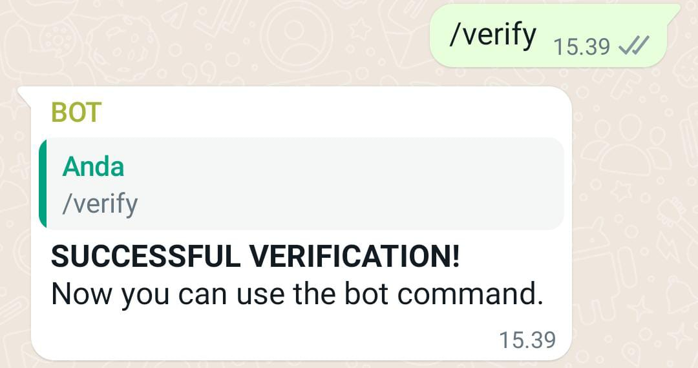
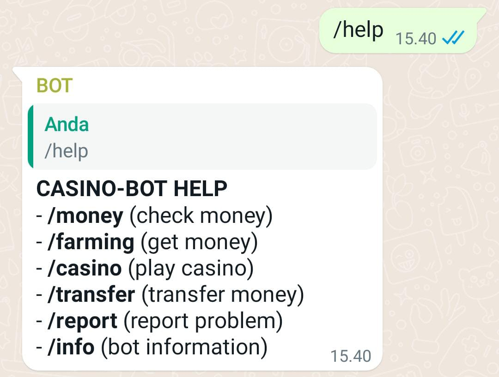
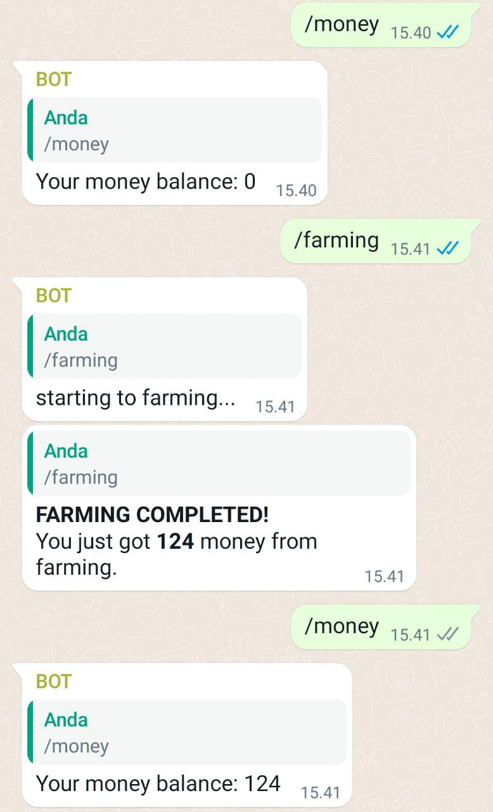
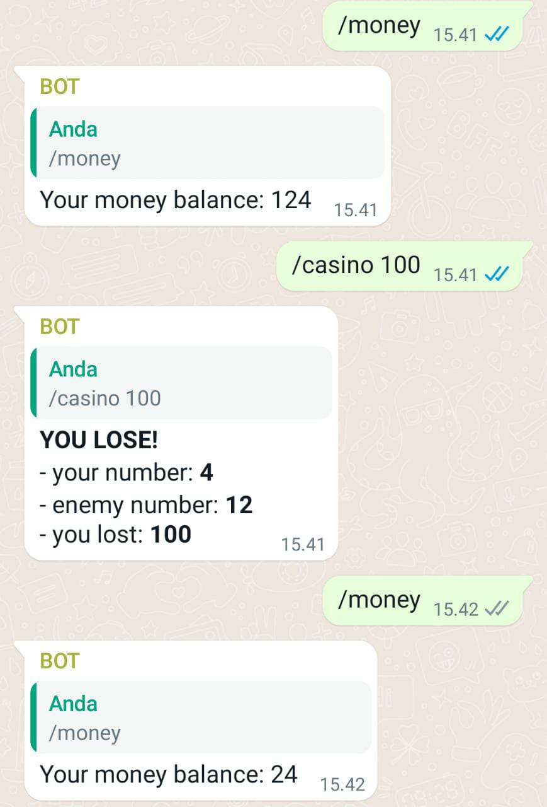
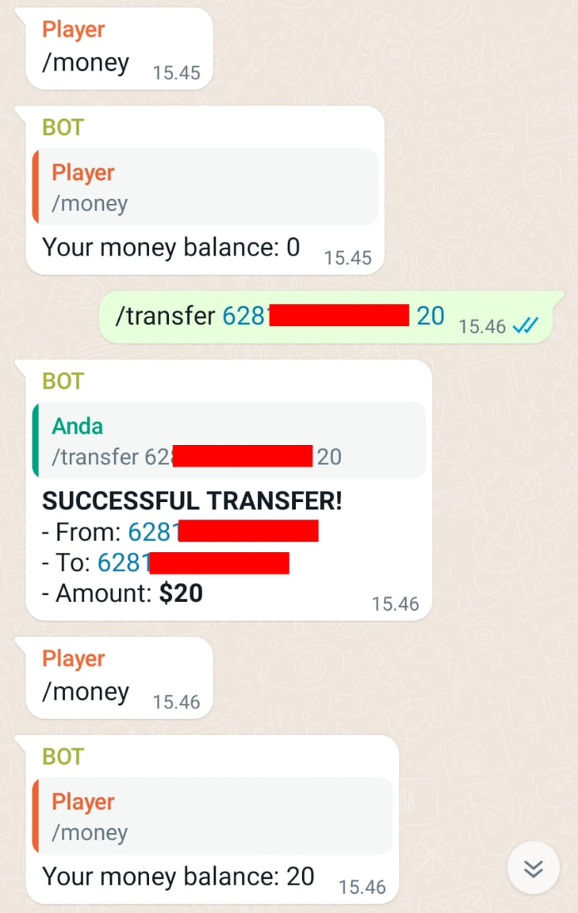

A free WhatsApp API bot source code, casino game concept.

### Installation
You need Node.js to run this project.
Here's the installation:
1. Download and install [Node.js](https://nodejs.org/en/download/)
2. Download and directory to this project.
3. Open your terminal and type the following command:
  ```sh
  npm install
  ```
4. Change the WhatsApp number that is in start.js file, at the first row using your WhatsApp number.
  ```sh
  const ownerNumber = "CHANGE THIS" + "@c.us"
  ```
5. Open your terminal again and run the start.js using 'node start.js' or 'npm start'.
6. You will be redirected to WhatsApp web and scan the qr code that will appear using your second WhatsApp number.
7. Wait until your terminal will output "CLIENT READY!"

### Usage
You can enter your WhatsApp and chat with the WhatsApp number that you have connected to the node.js server.
Here's a guide to using the commands available on this bot:
1. Type /verify to register your WhatsApp number on user.json so that you can use commands on the bot.
2. Use the /help command to display all available commands.
3. Use the /ownerhelp command to display commands that can only be used by the number listed in the ownerNumber variable at start.js file.

### Media





